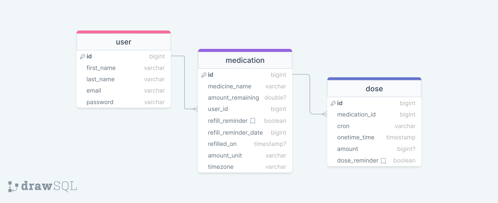

# DrugBugServer

[DrugBug](https://drugbug.netlify.app/) is a full-stack web app for tracking medications.
I made it using React, JavaScript, Node.js, Express,js, Knex, and Bootstrap. It includes a front end that allows users to add, view, and edit medications and doses to receive email and web push notifications when it is time for a dose or to order a refill. You can now also search for interactions your medications could have with food, drinks, or other medications.

This is the back end repository. The repository for the front end can be found [here](https://github.com/stevefali/DrugBug)

The server, where all the magic happens, grabs the current data in the MySQL database that I created, schedules notifications using cron syntax and triggers them in real time in worker threads that build notifications and then trigger them on the NotificationApi. The server also handles interaction searches by fetching data from the US FDA API and filtering through the results to find matches for the interactor queried by the user.
I had a lot of fun building this project, and I am particularly proud of having taught myself how to send web push notifications.

I also made a demo video of this app that you can find [here](https://youtu.be/tf2c68DhqRc?si=oKuBXN8g_pVAgMlx)


## Implementation

### Tech Stack

- React
- Node
- MySQL
- Express
- Client Libraries:
  - react
  - react-router
  - axios
  - Bootstrap
- Server Libraries:
  - Bree
  - knex
  - express
  - [NotificationApi](https://www.notificationapi.com)

## Installation Instructions

To install the React app ([DrugBug](https://github.com/stevefali/DrugBug)) you need to simply run ``` npm i ``` in the command line to install the node modules.

To install the server (this repo) you need to:
- Run ``` npm i ``` in the command line to install the node modules.
- Make a mysql database
	- ``` npm run migrate ```
 	- ``` npm run seed ```
    

### Database Structure


